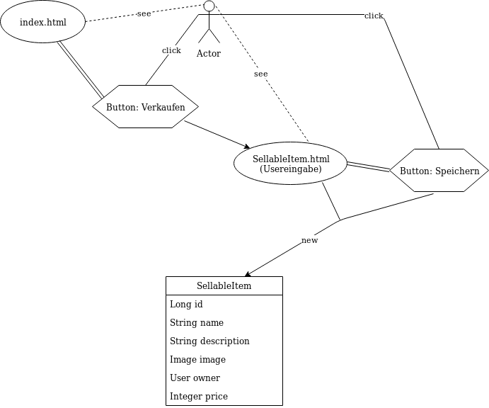
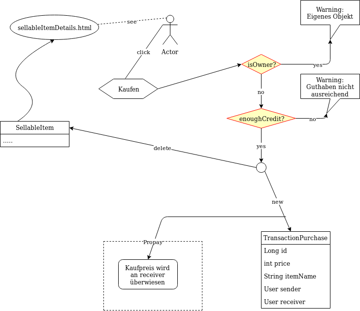
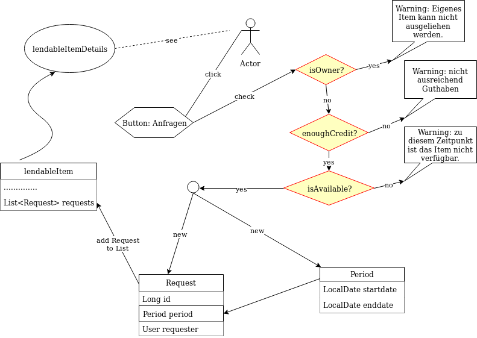
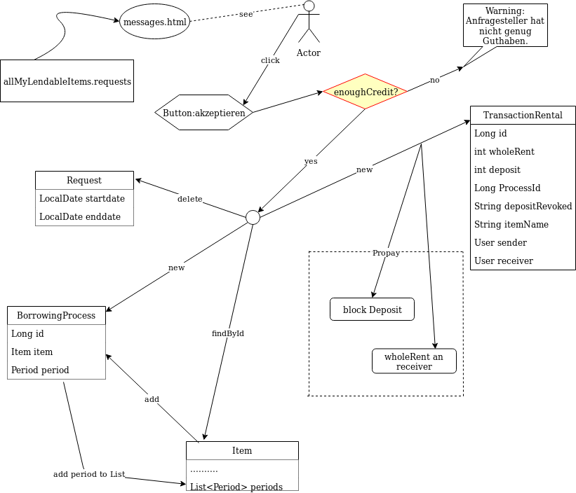
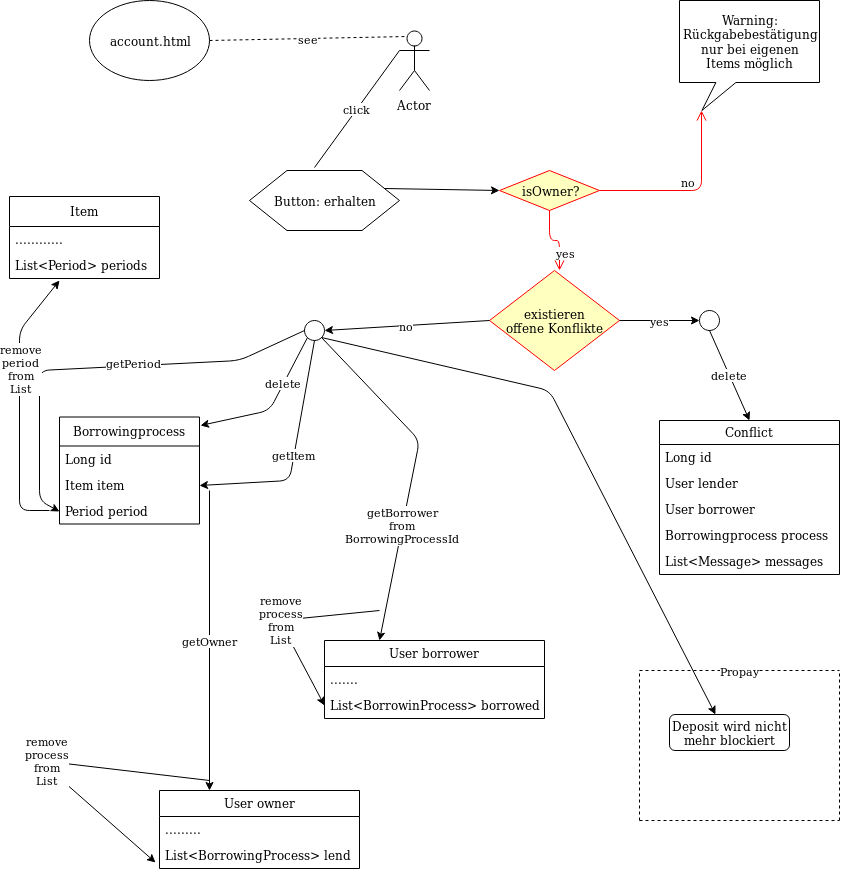
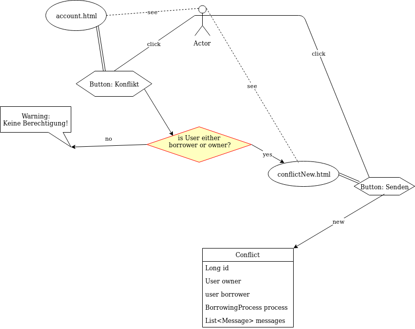
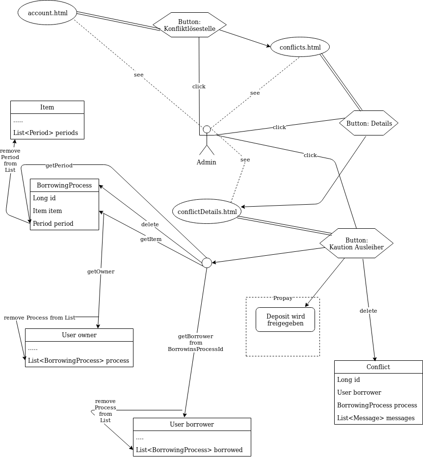

# Abschlussprojekt

_Bei Start der Anwendung werden mit Hilfe des Databaseinitializer User erzeugt.
Die User heißen user1, user2 usw. mit den korrespondierenden Passwörtern password1,
password2 usw.. Außerdem werden Items und Anfragen an verschiedene User
bezüglich des Ausleihens von Gegenständen (die akzeptiert und abgelehnt werden
  können) generiert. Des Weiteren gibt es einen admin, der das Passwort admin
  hat. Nur der Admin kann die Konflikte einsehen und lösen._

## Grundsätzliches

* Pair-programming.
* Morgens Gruppenmeeting.
* Retrospektiv-Meeting am Ende der Woche.
* Kein TDD, aber Test möglichst zeitnah schreiben.
* In jeden Commit schreiben, welche zwei Leute das gemacht haben(Vorname).
* Aufgaben die aktuell bearbeitet werden, bitte in der Datei aufgabenverteilung.adoc
schreiben (mit Namen)

## Codeformatierung & Richtlinien

* Commits im Imperativ und auf Englisch.
* Code auf Englisch, CamelCase verwenden.
* Tabs werden zum Einrücken verwendet.
* Checkstyle verwenden.
* FindBugs wird benutzt und Fehler zeitnah korrigiert.

## Aufgaben und Entscheidungen

* Funktionierende Travis-CI-Konfiguration [green big]#✔#
* Anwendung startet mit docker-compose up [green big]#✔#
* Anwendung ist unter Port 8080 erreichbar, keine anderen Ports sind erreichbar [green big]#✔#
** Die Propay-Anwendung ist unter dem Port 8888 erreichbar. Da allerdings vorgegeben wurde,
wie diese eingebunden werden soll, nehmen wir an, dass das akzeptabel ist.
* Die Anwendung unterstützt unterschiedliche Benutzerkonten, die parallel
angemeldet sind. [green big]#✔#
* Für alle Interaktionen mit der Anwendung muss der/die UserIn angemeldet sein. [green big]#✔#
* Es gibt eine Übersichtsseite der eingestellten Artikel. [green big]#✔#
** Diese ist unterteilt in Artikel, die zum Verkauf stehen und Artikel, die zu
Leihen sind, und ermöglicht auch die explizite Suche nach einzelnen Artikeln.
* Aus der Übersicht gelangt man zu einer Detailansicht jedes einzelnen
Artikels, indem man auf dessen Namen oder Bild klickt. [green big]#✔#
** Die Detailansicht der ausleihbaren Artikel enthält:
Namen und Beschreibung des Artikels, Angaben zu Tagessatz und Kaution,
Angaben zur Verfügbarkeit in Form
eines Kalenders, in dem die Daten an denen der Artikel bereits verliehen ist,
Angaben zur verleihenden Person(username), Angaben zum Standort des Artikel (die
  Adresse des Besitzers), Link um eine Anfrage zu senden.
  [green big]#✔#
** Die Detailansicht der käuflichen Artikel enthält:
 Name und Beschreibung des Artikels, Angaben zum Preis des Artikels, Angaben
zur verleihenden Person(username), Angaben zum Standort des Artikel (die
  Adresse des Besitzers), Link um den Artikel zu kaufen.
  [green big]#✔#
* Verleihbare Artikel können neu eingestellt werden mit (Button "Verleihen" auf
Startseite):
** Name, Artikelbeschreibung, Foto des Artikels(muss nicht zwangsläufig
  vorhanden sein), Kautionswert, Tagessatz
[green big]#✔#
* Käufliche Artikel können neu eingestellt werden mit (Button "Verkaufen" auf
Startseite"):
** Name, Artikelbeschreibung, Foto des Artikels (muss nicht zwangsläufig vorhanden
  sein), Preis
[green big]#✔#
* User können eine Anfrage schicken, die dann dem Besitzer des Artikels angezeigt
 wird. Dies gilt nicht für Artikel, die ihnen gehören. -> Warnung wird angezeigt.
** Hierbei wird eine Anfrage für einen bestimmten Zeitraum gestellt. Ist dieser
bereits vergeben, kann die Anfrage nicht gestellt werden.
** Es können nur Daten gewählt werden, die in der Zukunft liegen und bei denen
das Enddatum nicht vor dem Startdatum liegt (sonst -> Warnung und anfragen-Button
  disabled)
** Auch in der Ansicht für Anfragen werden die Daten, an denen der Gegenstand
bereits verliehen ist, rot markiert.
[green big]#✔#
* Die verleihende Person kann Anfragen annehmen oder ablehnen.
** Wird eine Anfrage angenommen, so werden alle Anfragen, die sich
mit dem Zeitraum der akzeptierten Anfrage überschneiden, automatisch gelöscht.
** Wird eine Anfrage angenommen, so ist der Gegenstand automatisch für den
Zeitraum ausgeliehen.
** Hierbei haben wir uns dafür entschieden, die ausgeliehenen Artikel sofort
in der Liste der geliehenen Artikel im Account anzuzeigen, wobei hier der
tatsächliche Ausleihzeitraum vermerkt ist. Die Liste der ausgeliehenen Artikel
umfasst somit alle anstehenden und laufenden Ausleihen.
[green big]#✔#
* Werden Artikel in gutem Zustand zurück gegeben, so kann die verleihende Person
dies bestätigen, sodass die Kaution wieder freigegeben wird und der
Ausleihprozess beendet wird.
** Wir haben uns dagegen entschieden, dass die leihende Person dies im System
beeinflussen kann, da hier die Wahrscheinlichkeit, dass nicht wahrheitsgemäße
Rückgaben erfolgen hoch ist. Weiterhin schien es uns nicht sinnvoll, dass die
leihende Person, die Rückgabe bestätigen muss. Er reicht, wenn der Besitzer
bestätigt, wenn er sein Eigentum zurückerhält.
** Gibt die leihende Person den Artikel zurück, ohne dass die ausleihende Person
dies im System angibt, so kann die leihende Person einen Konflikt auslösen.
Hiermit umgehen wir die Notwendigkeit, dass die leihende Person die Rückgabe
bestätigt.
** Wird der Artikel zu spät, gar nicht, oder defekt zurück gegeben, so kann die
verleihende Person einen Konflikt auslösen. Dies kann sie nur tun, bevor sie die
Rückgabe bestätigt. Wir haben uns dafür entschieden, dass das Bestätigen der Rückgabe
beinhaltet, dass der Artikel in zufriedenstellendem Zustand zurückgegeben wurde.
** Bei vor dem vereinbarten Zeitpunkt zurück gegebenen Artikeln, werden die
entsprechenden Tagessätze NICHT zurücküberwiesen.
   [green big]#✔#
* Vergisst eine Person einen Artikel zurückzugeben, so bekommt sie beim Einloggen
eine Erinnerungsnachricht. [green big]#✔#

* Sobald die ausleihende Person auf akzeptieren klickt wird die Kaution geblockt
und der Tagessatz überwiesen.
[green big]#✔#
* Anfragen können nur gestellt werden, wenn das Guthaben ausreicht (sonst -> PopUp Warnung).
[green big]#✔#
* Anfragen können nur akzeptiert werden, wenn das Guthaben der anfragenden Person
ausreicht (sonst -> Pop-up Warnung). [green big]#✔#
* Der Admin (username: admin, Passwort:admin) hat auf seiner account-Seite
einen Button mit Konfliktlösung, der auf eine Seite führt, auf der alle Konflikte
aufgelistet sind. Hier können die Details der Konflikte angesehen werden, in
denen die Usernamen und Emailadressen der Beteiligten, das entsprechende Item
und eine kurze Beschreibung des Konfliktes dargestellt werden.
** sowohl verleihende, als auch ausleihende Person können eine Konfliktanfrage
stellen, möchten beide einen Konflikt melden, so werden die einzelnen Nachrichten
in einem Konflikt gespeichert. Es ist auch möglich, dass die Beteiligten mehrere
Nachrichten in einen Konflikt schreiben.
** Der Admin kann auch Nachrichten in den Konflikt schreiben, sodass
der Konflikt prinzipiell über das System gelöst werden könnte.
** in der Detailansicht des Konfliktes kann der Admin die Kaution an die
entsprechende Partei überweisen, die sie erhalten soll (der Konflikt wird inhaltlich
  per Email gelöst)
[green big]#✔#
* Das Profil der angemeldeten Person kann von ihr eingesehen werden. [green big]#✔#
* Der Propay-Kontostand der angemeldeten Person, sowie alle eigenen Transaktionen
können auf der Propay-account-seite eingesehen werden (über die account-Seite
  erreichbar.) [green big]#✔#
* kauft eine Person einen Gegenstand, so wird dieser aus der Datenbanḱ entfernt
und die Abholinformationen auf der account-seite in der Liste der gekauften
Gegenstände angezeigt. [green big]#✔#
* Items können vom Besitzer bearbeitet und gelöscht werden, solange keine akzeptierten
Anfragen existieren (über account-ansicht). [green big]#✔#
* Es gibt eine Suche für leihbare und käufliche Gegenstände zusammen. [green big]#✔#
* Fotos für den Account und die Items können hochgeladen werden (auch nachträglich)
[green big]#✔#
* Es werden Passwörter verwendet (die user heißen user1, user2 usw und haben
  das korrespondierende Passwort password1, password2 usw.) [green big]#✔#
** werden im Databaseinitializer encryptet.
* Mithilfe von Fakern werden User, Passwörter, Items und Anfragen erzeugt.
[green big]#✔#
* Es gibt zwei verschiedene Rollen (user und admin). Admins haben mehr Berechtigungen
und können Konflikte einsehen und bearbeiten. [green big]#✔#

## Datenstrukturen
.User:
* username : String (id)
** user haben eindeutige Usernamen, die in der Datenbank als Id verwendet werden.
* password : String
* role : String
** Es gibt die Rollen Admin und User.
*** Admins können die Konfliktlösestelle in ihrem Account aufrufen, für User wird der entsprechende
Button nicht dargestellt.
* lastname : String
* forename : String
* email : String
* birthdate : LocalDate
* address : Address
* borrowedItems : List<BorrowingProcess>
* lendItems . List <BorrowinProcess>
* Image image

** Jeder Benutzer der Website wird als User Objekt gespeichert.
** Die User werden vom DatabaseInitializer mithilfe von Fakern autogeneriert.
** Die Regestrierung neuer User ist nicht möglich.
** Die Items, die dem User gehoeren werden hier nicht gespeichert, stattdessen
 wird in jedem Item der Besitzer vermerkt.

.Adress
* street : String
* city : String
* postcode : int
* Address:
** Jede Adresse eines Benutzers wird als Objekt der Klasse Address im User gespeichert.
** Address ist embeddable, damit Benutzer mit derselben Adresse diese speichern können.

.Item
* Item ist als MappedSuperclass annotiert und die Klassen lendableItem und
sellableItem erben von ihr
* id : Long
** ids werden von der Datenbank generiert.
* name : String
* description : String
* owner : User

.LendableItem
* Die Klasse LendableItem erbt von Item und ergänzt dieses um folgende Aspekte:
* rental: Integer
* deposit: Integer
* periods : List<Period>
** Hier werden die Zeitabstände vermerkt zu denen das Item bereits verliehen
wurde. Wird ein Request akzeptiert, so wird dessen
period zu dieser Liste hinzugefügt.
* requests : List<Request>
** Hier werden alle Requests die zu einem lendableItem gestellt werden
hinzugefügt.

.SellableItem
* Die Klasse SellableItem erbt von Item und ergänzt dieses um folgenden Aspekt:
* price : Integer
** SellableÌtems und LendableItems werden in zwei separaten Tabellen gespeichert
und haben somit auch separate Repositories, Controller und Services.

.Request
* id : Long
** ids werden von Datenbank generiert.
* period : Period
* requester : User
** User der ausleihen möchte.
* Ein neuer Request wird erzeugt, wenn ein User ein Item ausleihen möchte und es
zu diesem Zeitraum verfügbar ist

.Period
* startdate : LocalDate
* enddate : LocalDate

.BorrowingProcess
* id : Long
** Generated Value
* lendableItem : LendableItem
** LendableItem das ausgeliehen wird.
* period : Period
** Zeitraum zu dem das Item ausgeliehen wird.
** request der akzeptiert wurde, sodass das Item jetzt ausgeliehen ist.
-> Der BorrowingProcess repräsentiert den Ausleihprozess. Jeder User hat eine
Liste von laufenden BorrowingProcesses, die Items betreffen, die er verleiht
und eine Liste laufender BorrowingProcesses, die Items betreffen, die er geliehen
hat.

.Conflict
* id: Long
** Generated Value
* lender : User
* borrower : User
* process : BorrowingProcess
* messages : List <messages>
** Conflicts können von der ausleihenden und der verleihenden Person gestellt
werden. Da in jedem Conflict eine List von Messages gespeichert wird, können zum
zum Einen beide Parteien ihre Version des Konfliktes darstellen und diese Nachrichten
werden beide in demselben Konflikt gespeichert, zum anderen kann der Konflikt
 über das System selbst geklärt werden, indem Admin und
beide User Messages austauschen. Falls das Problem doch außerhalb des
Systems (per Email) geklärt werden soll, werden dem Admin die Emailadressen der
Beteiligten Parteien auf der Detailseite des Konfliktes angezeigt.

.Message
* author : String
* content : String
** Messages werden für die Konflikte verwendet, damit alle beteiligten Parteien
Nachrichten zu einem Konflikt schreiben können.

.Image
* id : Long
** Generated Value
* mimeType : String

## Webstruktur

.Base.html
* Alle Html-Dateien benutzen das Layout der base.html, sodass grundlegende Funktionen,
wie Suche, Verkaufen, Verleihen, Nachrichten, Account und Logout immer verfügbar sind.
* Die Suche sucht in dem Titel und der Beschreibung der Items und gibt die
Ergebnisse dann sortiert nach sellableItems und lendableItems wieder in zwei
Listen aus.
* Der Button "Verkaufen" linkt auf die Seite sellableItem.html, wo ein neues
SellableItem angelegt werden kann.
* Der Button "Verleihen" linkt auf die Seite newLendableItem.html, wo ein neues
LendableItem erzeugt werden kann.
* Der Button "account" linkt auf die Seite account.html, wo das eigene Profil
eingesehen werden kann.
* Der Button "Nachrichten" linkt auf die Seite messages.html, wo alle, die angemeldete
Person betreffenden, Requests dargestellt werden.

.Index.html:
* Enthält zwei Listen jeweils mit den kaufbaren und ausleihbaren Items.
* Der Name und das Bild des Items sind Links, der zu der Seite
lendableItemdetails.html bzw. sellableItem.html führt, wobei die Id des
entsprechenden Items mitgegeben wird.

* Details.html
** Es wird eine Detailansicht des entsprechenden Items dargestellt.
** Darunter steht ein Ausleihbutton und ein Zurückbutton.
** Der Ausleihbutton linkt auf Request.html und gibt dieser die Id des entsprechenden Items
mit.
** Der Zurückbutton linkt auf Index.html.

* messages.html:
** Enthält zwei Tabellen:
** Die erste Tabelle enthält eine Liste aller Requests, die an den angemeldeten User gestellt
wurden (Zu Items, die mir gehören.)
** Diese Requests kann die angemeldete Person akzeptieren oder ablehnen.

* propayAccount.html:
** Zeigt den ProPay Account Namen eines Nutzers
** Zeigt das aktuelle Guthaben des Accounts
** Darunter befindet sich die Möglichkeit durch ein Feld und einen Button "Aufladen" sein Guthaben zu erhöhen
** Es werden zwei Tabellen (mit aus- und eingehenden Transaktionen) angezeigt

.propayAccount.html:
* Zeigt das aktuelle Guthaben der angemeldeten Person an und wieviel von
dem aktuellen Guthaben aktuell durch Kautionen blockiert ist.
* Darunter befindet sich die Möglichkeit durch ein Feld und einen
Button "Aufladen" sein Guthaben um den eingegebenen Betrag aufzuladen.
* An dieser Stelle werden auch die vergangenen Transaktionen aufgezeichnet,
es gibt eine Liste in den eingegangene Zahlungen für verliehene und verkaufte
Gegenstände aufgeführt werden und eine Liste in der Zahlunge an andere Personen
für gekaufte und geliehene Gegenstände aufgeführt werden.

.account.html
* Hier ist eine Übersicht über die Daten der angemeldeten Person einsehbar,
wobei hier neue Accountbilder hochgeladen werden und der eigene PropayAccount
eingesehen werden können.
* Ist der Admin angemeldet, so wird ein großer Button auf dem "Konfliktlösestelle"
steht dargestellt. Dieser linkt zur Seite conflictView.html.
* Unter der Übersicht sind verschiedene Tabellen:
** ausgeliehene Objekte
*** Hier werden alle BorrowingProcesses dargestellt, die Items betreffen, die
die angemeldete Person ausgeliehen hat.
** Hier kann ein Konflikt gemeldet werden, falls die Kaution nicht rechtzeitig von
dem Besitzer des Gegenstandes freigegeben wurde. Der Button "Konflikt" linkt auf
die Seite conflictNew.html.
** verliehene Objekte
** Hier werden alle BorrowingProcesses dargestellt, die Items betreffen, die der
angemeldeten Person gehören.
*** Hier können Konflikte gemeldet werden, falls Gegenstände nicht rechtzeitig
oder unversehrt zurück gegeben wurden. Der Button "Konflikt" linkt auf
die Seite conflictNew.html.
Des Weiteren kann an dieser Stelle über den Button "erhalten"
bestätigt auch werden, dass der entsprechende Gegenstand rechtzeitig und unversehrt
zurückgegeben wurde, sodass der BorrowingProcess gelöscht wird, und die Kaution
freigegeben wird.
** Objekte zum Verkauf
*** Hier kann eingesehen werden, welche Gegenstände die angemeldete Person
zum Verkauf anbietet. Die einzelnen Objekte können hier bearbeitet und gelöscht
werden.
** Objekte zum Verleih
*** Hier kann eingesehen werden, welche Gegenstände die angemeldete Person
zum Verleih anbietet. Die einzelnen Objekte können hier bearbeitet und gelöscht
werden. Bearbeiten und Löschen ist nur möglich, wenn kein aktueller
BorrowingProcess existiert.
** gekaufte Objekte
*** Da gekaufte Objekte aus dem System entfernt werden, wird hier die
Abholinformation des Items dargestellt.
** verkaufte Objekte
*** Da verkaufte Objekte aus dem System entfernt werden, wird hier eine
Übersicht über die Gegenstände gegeben, die die angemeldete Person
verkauft hat.

.LendableItem.html
* An dieser Stelle wird ein neues Item zum Verleih erstellt.
* Die entsprechenden Angaben, wie Name, Beschreibung, Preis/Tag und Kaution
müssen gemacht werden, wobei das Hochladen eines Bildes optional ist.
* Für das bearbeiten der Angaben wird das selbe Template verwendet.

.SellableItem.html
* An dieser Stelle wird ein neues Item zum Verkauf erstellt.
* Die entsprechenden Angeben wie Name, Beschreibung und Preis müssen gemacht werden,
der Upload eines Bildes ist optional.
* Für das bearbeiten der Angaben wird das selbe Template verwendet.

.ConflictNew.html
* Hier wird ein neuer Konflikt erzeugt.
** Die angemeldete Person kann hier einen Freitext mit der Problembeschreibung
eingeben. Alle anderen relevanten Daten werden von dem System eingefügt.

.ConflictView.html
* Diese Seite ist nur für den angemeldeten Admin einsehbar.
* Hier wird eine Liste aller gemeldeten Konflikte dargestellt.
* Jeder Konflikt hat einen Button "Details", der zu der Seite conflictDetails.html
linkt.

.conflictDetails.html
* Hier werden alle relevanten Angaben eines Konfliktes dargestellt.
* Außerdem können hier neue Nachrichten zum bestehenden Konflikt hinzugefügt werden.
* Der Admin bekommt an dieser Stelle die Möglichkeit, die Kaution an eine der beiden
Parteien zu überweisen und den Konflikt somit zu lösen.

## ProPay
* Account (Hilfsklasse)
** wird zum Empfangen von Json Daten verwendet
. account : String (speichert den Namen des Accounts)
. amount : int (speichert den Kontostand des Accounts)
. reservations : ArrayList<Reservation> (speichert alle aktuell vorhandenen Kautionen)
* Reservation (Hilfsklasse)
** wird zum Empfangen von Json Daten verwendet)
. id : int (speichert die Id der Kautionsreservierung)
. amount : int (speichert die Höhe der Kaution/des Deposits)
* TransactionRental (Model)
** wird verwendet um die Transaktionen auf der Website darzustellen
. reservationId : int (speichert die Id der dazugehörigen Kautionsreservierung)
. wholeRent : int (speichert die summierte Miete fuer alle Tage)
. deposit : int (speichert die Höhe der Kaution)
. processId : long (speichert die Id des dazu gehörigen Ausleihprozess)
. depositRevoked : boolean (ist standardmäßig auf false gesetzt, wird auf true
  geändert, wenn die Kaution eingezogen wurde)

### ProPayService
* Regelt die Kommunikation mit der ProPay Scs
* Gibt bei (fast) allen Methoden den HTML (Fehler-)Code zurrück um bei Aufruf
individuell auf die Fehler reagieren zu können.
** bei einer Rückgabe von 200 kam es zu keinen Problemen
** bei -1 kam es zu internen Problemen, wie zum Beispiel Exceptions
** alle anderen Codes weisen auf fehlerhafte Kommunikation mit der ProPay Seite hin

### TransactionRentalService
* Stellt eine Methode zum erstellen und durchführen einer Transaktion zur
Verfügung
* Stellt eine Methode zur Verfügung, mit der sich prüfen lässt ob ein Guthaben
für die komplette Miete und Kaution ausreicht.

### ProPayController
* Verwaltet die ProPay Account Website
** es gibt unter anderem die Möglichkeit sein Guthaben aufzuladen

## Architektur

.architektur
image::./Diagram/Architektur.png[architektur]

## Notwendige Veränderungen bei Änderungen der Aufgabenstellung
Um auch den Verkauf der Items zu ermöglichen, haben wir das Projekt insofern
umstrukturiert, als das es nun eine Superklasse Item gibt, von der die
Klassen lendableItem und sellableItem erben. Hierbei sind Id, Name, Owner,
description, image im Item, im lendableItem die Deposit, Tagessatz und Requests
und im sellableItem der Preis des items.
In der Datenbank werden lendableItem und sellableItem in zwei unterschiedlichen
Tabellen gespeichert.
Analog zu den lendableItems und sellableItems wurden die entsprechenden
Transaktionen auch in zwei Kategorien aufgeteilt.

## Funktionsweise des Systems

_Die internen Prozesse des Systems werden hier in Diagrammform dargestellt, da
dies unserer Meinung nach übersichtlicher und einfacher zu verstehen ist._

### Anlegen eines verleihbaren Items

----
----

.new LendableItem

----
----

### Anlegen eines verkaufbaren Items
----
----

.new SellableItem

----
----

### Kaufen eines Items

----
----

.purchase Item

----
----

### Anfragen eines verleihbaren Objektes

----
----

.Make a new Request

----
----

### Akzeptieren einer Ausleihanfrage

----
----

.Accept a Request

----
----

### Löschen eines Requests

----
----

.delete a Request

----
----

### Bestätigung der Rückgabe eines Items

----
----

.confirm Item was returned

----
----

### Anlegen eines Konfliktes

----
----

.newConflict

----
----

### Auflösen eines Konfliktes zugunsten des Ausleihers

----
----

.settle Conflict

----
----

### Legende

----
----

.legende

----
----

## Quellen

* User Zeile 46 - 54: https://stackoverflow.com/questions/669828/how-to-have-2-collections-of-the-same-type-in-jpa

* Itembilder und Profilbilder:
https://github.com/callicoder/spring-boot-file-upload-download-rest-api-example/tree/mysql-database-storage
https://spring.io/guides/gs/uploading-files/
